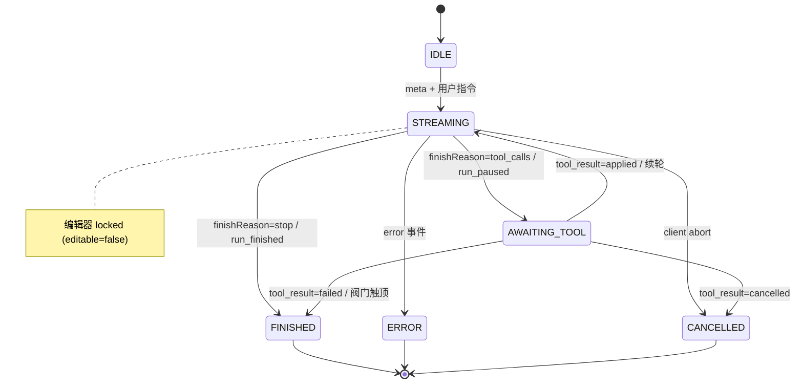
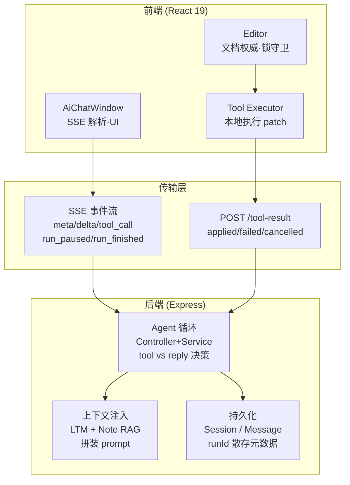

# Mnemo Agent 状态机设计

**读者画像**：面试官评估 Mnemo 架构；熟悉 React / Node / LLM Agent 基本概念，但不了解 Mnemo 内部实现。本文目标：用一张 run 级状态机图 + 一张架构位置图，把「Mnemo 怎么编排工具调用」讲清楚，并说明 run 状态当前如何存储。

---

## TL;DR

- Mnemo 的 Agent = 笔记编辑器里的「写模式」循环：一次用户指令 = 一个 run（`runId`），模型可多次调用工具改文档，直到给出终态回复。
- run 状态当前是**派生状态**：不在数据库建独立实体，而是散存在消息元数据（`runId` / `toolCalls` / `result`）+ SSE 信号驱动，读路径（回放）按 `runId` 聚合还原。
- 核心循环只有两个活跃态：`STREAMING`（模型流式生成，编辑器锁住）↔ `AWAITING_TOOL`（`run_paused`，前端本地执行工具）；终态为 `FINISHED` / `ERROR` / `CANCELLED`。
- 内置安全阀 `WRITE_RUN_MAX_ROUNDS`，防止工具轮失控无限循环。

---

## 1. 术语

- **run（运行）**：一次用户指令触发的完整 Agent 执行过程，用 `runId` 唯一标识；续轮（工具结果回传后的下一轮模型调用）复用同一 `runId`，不算新 run。
- **Agent 循环**：后端 Controller + Service 在写模式下「判断是否要调工具 → 等工具结果 → 继续生成」的编排逻辑，对应图 1 的状态机。
- **SSE 事件**：服务端通过 Server-Sent Events 下发的状态 / 数据信号，是状态机的迁移触发源（`meta` / `tool_call` / `delta` / `run_paused` / `run_finished` / `done` / `error`）。

---

## 2. run 级状态机（图 1）

### 状态枚举

| 状态            | 含义                             | 进入条件                                                  | 退出条件                                                                                           |
| ------------- | ------------------------------ | ----------------------------------------------------- | ---------------------------------------------------------------------------------------------- |
| IDLE          | 无活跃 run                        | 初始 / 上轮结束                                             | 收到指令 → 发 `meta`                                                                                |
| STREAMING     | 模型流式生成，编辑器 `editable=false` 锁住 | `meta` 之后                                             | `finishReason=tool_calls`→`AWAITING_TOOL`；`=stop`→`FINISHED`；`error`→`ERROR`；abort→`CANCELLED` |
| AWAITING_TOOL | `run_paused`，等待前端执行工具          | 流结束带 `tool_calls`                                     | POST `tool-result`：applied→`STREAMING`（续轮）；failed/cancelled→`FINISHED`/`CANCELLED`             |
| FINISHED      | run 终态，解锁编辑器                   | 无 `tool_calls` 自然结束 / 阀门触顶 / tool 失败合成 `run_finished` | —                                                                                              |
| ERROR         | 流中断终态                          | `error` 事件                                            | —                                                                                              |
| CANCELLED     | 用户取消终态                         | client abort / `tool_result=cancelled`                | —                                                                                              |

### 迁移与 SSE 映射（已 verify 代码）

- **IDLE → STREAMING**：`chat.controller.ts:166` 发 `meta{sessionId, title, runId}`。
- **STREAMING → AWAITING_TOOL**：`chatStream.service.ts:282` 检测 `finishReason==='tool_calls' || toolCallAcc.size>0`；`chat.controller.ts:196/400` 发 `run_paused{runId}`（取代本轮 `done`）。
- **STREAMING → FINISHED**：普通回复轮发 `done`；写模式 run 收尾再发 `run_finished`（`chat.controller.ts:218/327/427`）。
- **AWAITING_TOOL → STREAMING**：前端 POST `tool-result`（applied）→ 续轮复用 `runId` 回到 `STREAMING`。
- **AWAITING_TOOL → FINISHED / CANCELLED**：`tool_result` status 白名单 `applied/failed/cancelled`（`chat.controller.ts:251`），failed / cancelled 由后端悬挂兜底合成 `run_finished`。
- **安全阀**：任意轮次 ≥ `WRITE_RUN_MAX_ROUNDS` → 合成 `run_finished{message: WRITE_RUN_MAX_ROUNDS_MSG}` → `FINISHED`（`chat.controller.ts:327-339`）。

---

## 3. 架构位置（图 2）

- 前端 **Editor 是文档权威**，工具在前端本地执行（patch 写入 + 高亮 + 锁守卫），不往返服务端改文档；后端只做 tool-vs-reply 决策。
- 传输层：SSE 事件流（下行）+ `POST /tool-result`（上行）。
- 后端 Agent 循环依赖上下文注入（LTM 长期记忆 + Note RAG 笔记检索）拼装 prompt，`run` 状态散存 Session / Message 元数据（`runId` / `toolCalls` / `result`）。

---

## 4. 状态存储：派生 vs 显式（设计决策）

当前采用**派生状态**：状态不在库里建独立实体；回放（F8）扫 `role:'tool'` 消息按 `runId` 聚合，live 状态在 React 组件维护。

- **为什么这样**：写模式工具调用已落地，派生方案零额外存储、无状态机一致性负担，能跑能回放。
- **为什么不立刻做显式实体**：显式 `AgentRun` 需新增集合 + `state` 字段 + 迁移逻辑，带来写一致性与维护成本；在当前 scope（solo、读路径靠聚合已满足）收益有限。
- **若未来需要**（刷新后恢复 run 中途态、取消服务端权威、回放免重扫），再引入显式 `AgentRun` 实体——属可选增强，非必做。

---

## 5. SSE 事件定义

下表定义每个事件的触发时机、关键 payload 与在状态机中的角色；与 §2 的「迁移↔代码映射」互补——§2 讲哪个迁移对应哪行代码，本节讲每个事件本身是什么。来源：`chat.controller.ts`。

| 事件 | 触发时机 | 关键 payload | 在状态机中的角色 |
|---|---|---|---|
| `meta` | 每轮流开始（首轮 + 续轮） | `{sessionId, title?, runId}` | IDLE → STREAMING 信号；续轮回传同一个 `runId` |
| `delta` | 模型正文流式产出 | `{content}` | STREAMING 状态的内容载体 |
| `tool_call` | 模型决定调用工具（流式拼接） | tool 描述（name / arguments） | 触发 `run_paused` 的前奏 |
| `run_paused` | 流结束且带 `tool_calls` | `{runId}` | STREAMING → AWAITING_TOOL（取代本轮 `done`） |
| `run_finished` | run 终态 / 阀门触顶 | `{runId, message?}` | → FINISHED，解锁编辑器 |
| `done` | 普通回复轮终态 | `[DONE]` | 非 run 级终态（写模式 run 收尾后再发 `run_finished`） |
| `error` | 流中断 | `{error: 'Stream interrupted'}` | → ERROR |
