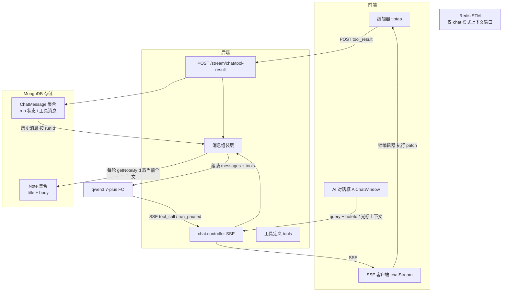
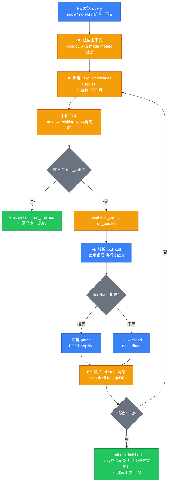
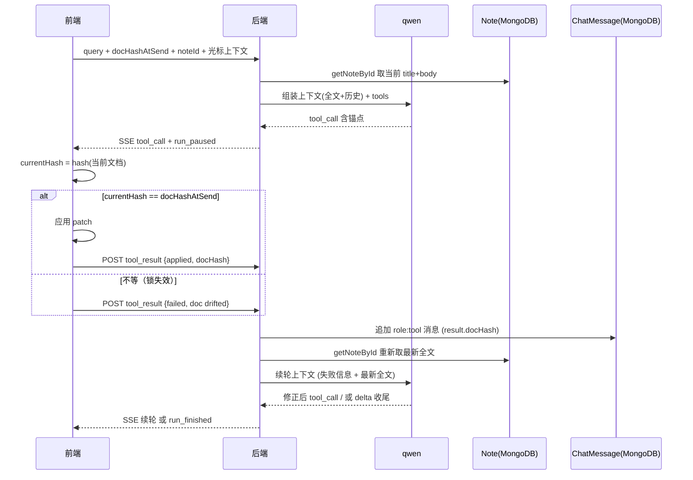

# Mnemo 工具调用功能设计 v1.1

> 版本：v1.1（已定稿，2026-09-15 审批通过）  
> 日期：2026-09-15
> 范围：产品功能设计 + 技术架构定性。不含实现步骤与代码。  

---

# 0. 总览（架构 + 方案）

## 0.1 整体架构

执行器留在前端（编辑器是文档权威状态），loop 走消息历史；后端只负责组装上下文、调 LLM、收 tool_result 并续轮。run 状态全部落在 MongoDB 的 ChatMessage 集合，**无新增 Redis run 状态**。Redis STM 仅作为 chat 模式的历史上下文窗口缓存，与写模式 run 状态是两回事。



> 注：`STM`（Redis）只服务 chat 模式的历史上下文窗口（`shortTermMemory.ts`），不参与写模式 run 状态。写模式上下文每轮从 `Note` 集合实时取，见 §2。

## 0.2 方案概要

- **架构选型**：前端执行器 + 观察回传续轮 loop（方案 B）。否决后端直写 DB——避免双写者冲突、反向同步深水区、绕过内容索引管线、引入版本管理。
- **loop 载体**：消息历史即 agent 状态，零内存状态、无需 Redis、刷新不丢（§2.3）。
- **三工具**：`update_title` / `insert_at_cursor` / `replace_selection`；单轮最多一个 tool_call。
- **续轮端点**：专用 `POST /stream/chat/tool-result`，请求内联返回下一轮 SSE。
- **整 run 锁**：从生成到 run_finished / 取消，编辑器只读，run 内 docHash 恒定。
- **守卫**：docHash 机器层字段做锁失效守卫，组装模型上下文时剥离（模型看不到）。
- **兜底**：悬挂 cancelled 合成（上下文完整性）+ run 可见性兜底（用户可感知）；参数校验失败后端合成 failed 直续轮。

## 0.3 关键定论（来自设计会话）

1. **STM ≠ run 状态**：Redis STM 是请求期上下文窗口缓存；design doc 「无需 Redis」只指 run 状态，写模式上下文不能走 STM（会丢 toolCalls/tool payload），改从 MongoDB 按 mode+noteId 组装。
2. **loop 按 round 计数**：数 `runId` 下 `assistant(toolCalls)` 消息条数；3 轮是安全阀非主循环条件，主条件是「LLM 响应是否带 tool_calls」。
3. **agent 状态 = 持久化消息**：`assistant(toolCalls)` + `tool(result)` 是 run 状态的真身；`tool_call` / `run_paused` / `run_finished` 三个 SSE 事件是瞬时控制信令，不进历史。
4. **收尾是 loop 自然终止态**：LLM 本轮不带 tool_calls 即收尾（"已写入 X"文本轮），非强制额外 LLM 调用；失败触顶（轮数≥3 且最后一轮 tool_result 仍为 failed）直接 emit run_finished，并**由后端合成收尾说明**（告知用户操作未完成、run 已关闭），**不调用第 4 次 LLM 假收尾**。完整兜底规范见 `tool-calling-detail.md` §3.5。
5. **docHash / contentHash 职责分离**：docHash 仅锁失效守卫；contentHash 属 NoteChunk 脏标记/增量索引管线，由编辑器 autoSave/保存链路更新，tool-calling 流程不碰。
6. **写模式上下文每轮重取（后端快照，非应用权威）**：多轮 patch 持续改写文档，后端每轮 `getNoteById` 取一份「最新全文快照」喂给 LLM，生成下一轮 patch 锚点。需明确：这层快照是**后端视角的 best-effort 上下文，不是应用权威**——文档真正权威是前端编辑器，`docHash` 守卫完全在前端本地（比对发送瞬间与落笔瞬间的编辑器哈希），与后端快照解耦。两者靠两道机制收敛：① **整 run 锁**禁止 run 期间用户编辑，文档唯一变更来源是 LLM patch，结构性消除用户并发漂移；② **前端 await autoSave 后再 POST tool_result**，保证下一轮 `getNoteById` 看到上一轮 patch 落库。首轮若 autoSave 在途导致后端快照略旧，LLM 锚点可能偏差，但 patch 由前端按编辑器权威应用、失败即走 §2.3 重试回喂，最终收敛。落点 `note.service.ts:66 getNoteById`。

---

# 1. Agent Loop 流程图（完整）



> 图例：蓝=前端 / 琥珀=后端 / 灰=判定 / 绿=终态。三个 SSE 事件（tool_call / run_paused / run_finished）是瞬时控制信令，不持久化；run 状态以 `assistant(toolCalls)` + `tool(result)` 消息持久化于 MongoDB。

---

# 2. 写模式上下文装配与端到端数据流

## 2.1 每轮上下文组成

写模式**每一轮 LLM 调用**都重新组装，不缓存首轮结果：

```
write 模式上下文（后端组装） =
    system prompt
  + 笔记 title + body 快照（getNoteById(noteId) 每轮实时取，非首轮缓存）
  + 历史消息（user / assistant(toolCalls) / tool(result)，按 runId 过滤）
  + 本轮用户指令
  // docHash / docHashAtSend 在此剥离，不进模型上下文
```

> 落点：`note.service.ts:66 getNoteById(noteId, user)` 每轮实时取 title+body 作为**喂给 LLM 的上下文快照**。
> 注意：**这份快照是后端视角、best-effort，不是应用权威**。真正的文档权威是前端编辑器，`docHash` 守卫完全在前端本地比对（发送瞬间 vs 落笔瞬间），与后端快照解耦（见 §0.3.6 与 §3）。后端快照与前端编辑器的收敛靠「整 run 锁 + 前端 await autoSave 后再回传 tool_result」两道机制，详见 §2.3 与 §3.5。

## 2.2 端到端数据流（含 docHash）



## 2.3 失败修正的上下文回喂

失败分支（doc drifted / 锚点失配）POST `tool_result{failed, error}` 后，后端**不更新任何 hash**（文档未变）。关键是续轮重新 `getNoteById` 取最新全文并重注入，使模型同时看到：① 刚失败的 `tool(failed)` + error；② 当前最新文档全文。模型据此重新生成正确参数或决定收尾。若无最新全文回喂，模型只在旧上下文里"知道失败"却不知文档现状，无从修正——这正是写模式上下文**必须每轮重取**的根本原因。

## 2.4 docHash 与 contentHash 职责分离

- **docHash**（tool-calling-detail.md）：写模式下「标题+正文」在发送瞬间算的哈希，仅用于 patch 应用前的锁失效守卫。纯机器层，组装时剥离，模型看不到。
- **contentHash**（笔记 RAG）：NoteChunk 脏标记管线的笔记内容哈希，由编辑器 autoSave/保存链路负责更新、触发增量索引。归笔记保存管线所有，tool-calling 流程不碰。
- 应用 patch 后文档改变走的是**编辑器 autoSave → 笔记保存管线 → 更新 contentHash + 触发脏标记重索引**；tool-calling 流程只负责"生成+应用 patch"，不管理 contentHash。

---

# 3. docHash 数据流（锁失效守卫）

## 3.1 定义

`docHash` 是机器层字段，不是模型信号。模型无法计算哈希，"感知版本漂移"只理论上成立且无行动路径（工具集无读文档工具，整 run 锁又使 run 内漂移被结构性消灭，跨 run 漂移由每轮全文注入覆盖）。其真实价值：① 配合 `docHashAtSend` 做锁失效守卫；② run 回放 / 撤销遥测对账（验证锁期间文档确实未变）。组装 LLM messages 时剥离 docHash，不进入模型上下文。

## 3.2 上行：docHashAtSend（随 query 发送）

写作模式下，前端在**消息发送瞬间**对「标题 + 正文」算哈希得到 `docHashAtSend`，与 `noteId` / `selection` / `cursorContext` 一起随消息上行（请求体字段定义见 `tool-calling-detail.md` §5.1 工具协议：含 `noteId` / `docHashAtSend` / `selection{text}` / `cursorContext{beforeText,afterText}`）。这是 run 起始的机器级守卫基准。此时模型上下文里只有笔记全文（用于生成工具锚点），不含任何哈希。

```jsonc
{
  "noteId": "string",
  "docHashAtSend": "string",
  "selection": { "text": "string" } | null,
  "cursorContext": {
    "beforeText": "string",
    "afterText": "string"
  } | null
}
```

## 3.3 应用前守卫与分支（前端执行器，对应 `tool-calling-detail.md` §7.2）

（以下逻辑实现于前端执行器，对应 `tool-calling-detail.md` §7.2）patch 到达前端后、落笔前：

- `currentHash = hash(当前文档)`；
- 若 `currentHash === docHashAtSend`：锁有效、文档未被意外改动 → 执行单事务 patch（高亮 + 单 history step）；
- 若不等：锁失效（用户/竞态漏改）→ 拒绝应用，回传 `{status:'failed', error:'doc drifted'}`，后端续轮、模型修正重试。

## 3.4 下行：docHash（随 tool_result 返回）

patch 应用成功后，前端算「应用后文档哈希」`docHash`，随 `POST /stream/chat/tool-result` 上行（§6.2）：

```jsonc
{
  "sessionId": "string",
  "toolCallId": "string",
  "status": "applied" | "failed",
  "docHash": "string",
  "titleAfter": "string",
  "error": "string"
}
```

`docHash` 入库于 `tool(result)`，用于回放/遥测对账；组装下一轮上下文时同样被剥离。

## 3.5 多轮 run 的 docHash 基线语义（实现备注）

doc 表述「docHashAtSend 为 run 起始快照、整 run 锁保证不漂移」对**多轮 run** 需细化：AI 自己的 patch 必然改写文档，若基线只取首条 query 快照，第 2 轮应用前比对必失败误杀。正确语义：基线应为**该轮 tool_call 所基于的文档状态**（即该轮上下文组装时前端快照的哈希）。实现上建议**每个 round 重新快照 docHashAtSend**（每轮续轮也是一次消息上行），或前端执行器自行跟踪「上一轮应用后的期望哈希」作为下一轮比对基准。守卫只抓「前端执行器之外来源改了文档」这一种锁失效情形。

---

# 4. 工具集与上下文需求

三工具都依赖「模型手头有当前笔记内容」。结合 §2 的每轮全文注入，各自所需上下文：

| 工具 | 需要的上下文 | 来源 |
| --- | --- | --- |
| `update_title` | 原标题（必给）+ 全文（要总结全文取标题时） | getNoteById 注入 |
| `insert_at_cursor` | 光标邻域（beforeText/afterText）+ 全文（保证连贯 / 总结段落） | cursorContext + getNoteById 注入 |
| `replace_selection` | 选中文本 + 修改规则；**基于全文重生成时还需全文**（如选中一段总结，给定规则让 LLM 按全文重写总结） | selection.text（上行带）+ 用户指令 + getNoteById 全文（重生成场景） |

> 三者都要求写模式上下文**每轮重取当前笔记全文**（§2.1），否则第 2 轮起锚点过期、失败后无法修正。
